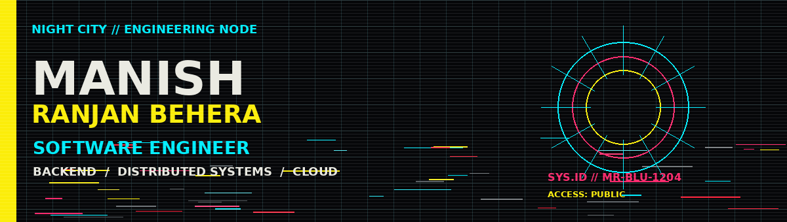
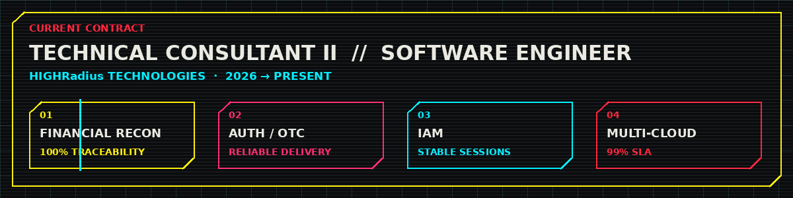
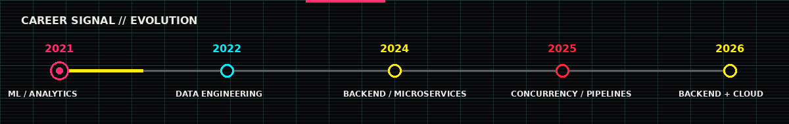

<div align="center">



<a href="#about"><kbd> ABOUT </kbd></a>
<a href="#impact"><kbd> IMPACT </kbd></a>
<a href="#focus"><kbd> STACK </kbd></a>
<a href="#mission"><kbd> NOW </kbd></a>
<a href="#journey"><kbd> JOURNEY </kbd></a>
<a href="#code"><kbd> CODE </kbd></a>
<a href="#awards"><kbd> TROPHIES </kbd></a>

<br><br>

<a href="https://www.linkedin.com/in/manishranjanbehera/">

</a>
&nbsp;
<a href="https://github.com/MrBlu1204">

</a>
&nbsp;
<a href="https://leetcode.com/u/MR-Blu/">

</a>
&nbsp;
<a href="https://www.hackerrank.com/profile/MR_Blu">

</a>

<br><br>

<kbd>JAVA</kbd> <kbd>SPRING BOOT</kbd> <kbd>MICROSERVICES</kbd> <kbd>DISTRIBUTED SYSTEMS</kbd> <kbd>CLOUD</kbd>

</div>

---

<a id="about"></a>

## `SYS::IDENTITY`  ◇  ABOUT ME

<table>
<tr>
<td width="62%" valign="middle">

### **Software Engineer · Backend / Distributed Systems / Cloud**

**4+ years** building and troubleshooting backend services, distributed data pipelines and cloud infrastructure. I work mainly with **Java + Spring Boot**, with a bias toward **performance, concurrency, reliability and observability**.

> `BUILD` resilient systems → `DEBUG` hard production failures → `OPTIMIZE` bottlenecks → `OPERATE` at scale

</td>
<td width="38%" align="center">

```text
┌─────────────────────┐
│  ENGINEERING DNA    │
├─────────────────────┤
│ JAVA        ████████ │
│ BACKEND     ████████ │
│ CLOUD       ██████░░ │
│ DATA        ██████░░ │
│ SYSTEMS     ███████░ │
└─────────────────────┘
```

</td>
</tr>
</table>

---

<a id="impact"></a>

<div align="center">

## `// ENGINEERING IMPACT`

| **4+ YRS** | **99%** | **25% ↑** | **15% ↓** | **400K+** |
|:---:|:---:|:---:|:---:|:---:|
| EXPERIENCE | UPTIME SLA | THROUGHPUT | API LATENCY | REQUESTS / DAY / CLIENT |

| **100%** | **100%** | **35% ↓** | **25% ↓** | **8 HRS/WK** |
|:---:|:---:|:---:|:---:|:---:|
| LEDGER TRACEABILITY | DATA ACCURACY | PROCESSING TIME | SUPPORT TICKETS | MANUAL ANALYSIS |

<details>
<summary><b>↳ DECODE THE METRICS</b></summary>

<br>

`100% TRACEABILITY` — automated Credit Note reconciliation for enterprise ledgers  
`99% SLA` — multi-cloud monitoring across AWS, GCP and Azure  
`25% THROUGHPUT ↑` — scalable Java/Spring Boot backend services  
`15% API LATENCY ↓` — backend optimisation  
`400K+ / DAY / CLIENT` — Microsoft Graph API ingestion pipelines  
`35% PROCESSING ↓` — data/query optimisation  
`25% SUPPORT TICKETS ↓` — internal diagnostic automation  
`8 HRS / WEEK` — manual analysis eliminated

</details>

</div>

---

<a id="focus"></a>

<div align="center">

## `// ENGINEERING FOCUS`

</div>

<table align="center">
<tr>
<td width="25%" align="center">

### ⚡ BUILD

  

`Java` · `Spring Boot`  
`REST` · `Microservices`

</td>
<td width="25%" align="center">

### 🧬 SCALE

  

`Multithreading`  
`ETL` · `Distributed Systems`

</td>
<td width="25%" align="center">

### ☁ OPERATE

  

`AWS` · `GCP` · `Azure`  
`CI/CD` · `Observability`

</td>
<td width="25%" align="center">

### 🧠 DATA

 

`SQL` · `Python`  
`MySQL` · `ClickHouse`

</td>
</tr>
</table>

<div align="center">

`PROMETHEUS` · `GRAFANA` · `MAVEN` · `GIT` · `CI/CD` · `REST APIs` · `OOP` · `DSA`

</div>

---

<a id="mission"></a>

<div align="center">

## `// CURRENT MISSION`  `[ HIGH PRIORITY ]`



**TECHNICAL CONSULTANT II · SOFTWARE ENGINEER**  @  **HIGHRadius Technologies**  ·  **2026 → PRESENT**

</div>

<table align="center">
<tr>
<td align="center"><b>01 · RECON</b><br><sub>Credit Note automation<br><b>100% traceability</b></sub></td>
<td align="center"><b>02 · AUTH</b><br><sub>Java / SMTP recovery<br><b>OTC delivery restored</b></sub></td>
<td align="center"><b>03 · IAM</b><br><sub>Multi-tenant backend<br><b>stable sessions</b></sub></td>
<td align="center"><b>04 · CLOUD</b><br><sub>AWS · GCP · Azure<br><b>99% SLA</b></sub></td>
</tr>
</table>

---

<a id="journey"></a>

<div align="center">

## `// CAREER MAP`



**ML / ANALYTICS** → **DATA ENGINEERING** → **BACKEND / MICROSERVICES** → **CONCURRENCY / PIPELINES** → **BACKEND + CLOUD**

</div>

<details>
<summary><b>↳ OPEN CAREER LOG</b></summary>

<br>

| PERIOD | MODE | SIGNAL |
|:---:|:---|:---|
| **2021–22** | Machine Learning / Analytics | Regression, AWS EC2, prediction pipelines |
| **2022–23** | Data / Analytics Engineering | Python, SQL, stored procedures, query optimisation |
| **2024** | Backend Engineering | Java, Spring Boot, Hibernate, microservices |
| **2025** | Distributed / Concurrency Engineering | Thread pools, race conditions, high-volume ingestion |
| **2026–Now** | Backend + Cloud Engineering | Reconciliation, auth, IAM, multi-cloud observability |

</details>

---

<a id="code"></a>

<div align="center">

## `// CODE TERMINAL`

<table align="center">
<tr>
<td width="50%" align="center">

<a href="https://leetcode.com/u/MR-Blu/">

</a>

### LEETCODE · `MR-Blu`

**90 Java** · **29 MySQL** · **1 JavaScript**

`Dynamic Programming` · `Database`  
`Array` · `String` · `Two Pointers`

[OPEN PROFILE ↗](https://leetcode.com/u/MR-Blu/)

</td>
<td width="50%" align="center">

<a href="https://www.hackerrank.com/profile/MR_Blu">

</a>

### HACKERRANK · `MR_Blu`

**Java Developer**

`Problem Solving · Basic`  
`Problem Solving · Intermediate`  
`Python · Basic` · `SQL · Basic`

[OPEN PROFILE ↗](https://www.hackerrank.com/profile/MR_Blu)

</td>
</tr>
</table>

<details>
<summary><b>↳ OPEN HACKERRANK CERTIFICATES</b></summary>

<br>

[Problem Solving](https://www.hackerrank.com/certificates/1d8d323aa708) ·
[Problem Solving](https://www.hackerrank.com/certificates/3e48f793c15e) ·
[Python](https://www.hackerrank.com/certificates/21e9743aed89) ·
[SQL](https://www.hackerrank.com/certificates/717ae1a5aeda)

</details>

</div>

---

<a id="awards"></a>

<div align="center">

## `// TROPHY VAULT`


### `5× HIGHFLYER RECOGNITIONS`

</div>

<details>
<summary><b>↳ OPEN AWARD RECORDS</b></summary>

<br>

| YEAR | CLASS | RECOGNITION |
|:---:|:---:|:---|
| **2025** | 🟨 ANNUAL | **Annual Award — Highflyer** |
| **2024** | 🟥 APPLAUSE | **Award of Applause — Highflyer Q2** |
| **2023** | 🟦 APPLAUSE | **Award of Applause — Highflyer H1** |
| **2021** | 🟪 TEAM | **Team of the Year — Highflyer** |
| **2021** | 🟦 STAR | **Star Team Award — Highflyer Q3** |

</details>

---

<div align="center">

## `// EDUCATION NODE`

**KIIT · B.Tech — Computer Science & System Design**  
**CGPA 9.0** · 2018 — 2022

<br>

<a href="mailto:manish12042000@gmail.com"><kbd>EMAIL</kbd></a>
<a href="https://www.linkedin.com/in/manishranjanbehera/"><kbd>LINKEDIN</kbd></a>
<a href="https://github.com/MrBlu1204"><kbd>GITHUB</kbd></a>
<a href="https://leetcode.com/u/MR-Blu/"><kbd>LEETCODE</kbd></a>
<a href="https://www.hackerrank.com/profile/MR_Blu"><kbd>HACKERRANK</kbd></a>

<br><br>

`BUILD WHAT MATTERS.`  ·  `DEBUG THE IMPOSSIBLE.`  ·  `KEEP SHIPPING.`

</div>
