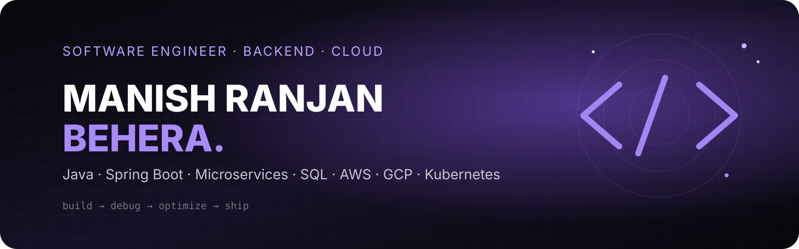

 

<a href="#profile"><kbd>PROFILE</kbd></a> &nbsp; <a href="#impact"><kbd>IMPACT</kbd></a> &nbsp; <a href="#stack"><kbd>STACK</kbd></a> &nbsp; <a href="#experience"><kbd>EXPERIENCE</kbd></a> &nbsp; <a href="#projects"><kbd>PROJECTS</kbd></a> &nbsp; <a href="#coding"><kbd>CODING</kbd></a> &nbsp; <a href="#recognition"><kbd>RECOGNITION</kbd></a> &nbsp; <a href="#contact"><kbd>CONTACT</kbd></a>

  

&nbsp;&nbsp;

&nbsp;&nbsp;

&nbsp;&nbsp;

&nbsp;&nbsp;

  

<a href="https://raw.githubusercontent.com/MrBlu1204/MrBlu1204/main/assets/ManishRanjanBehera_Resume_v26.0820s.pdf"><strong>⬇ DOWNLOAD RESUME</strong></a>
&nbsp;&nbsp;•&nbsp;&nbsp;
<a href="https://yashwanth-patam-portfolio.vercel.app/"><strong>VIEW REFERENCE PORTFOLIO ↗</strong></a>

---

<table width="100%"><tr><td width="62%" valign="top">

## 👋 PROFILE

### Software Engineer · Backend · Distributed Systems · Cloud

Software Engineer with **4+ years of experience** architecting scalable backend microservices, distributed data pipelines and cloud infrastructure using **Java, Spring Boot, AWS and Kubernetes**.

I work across **REST APIs, microservices, SQL, multithreading, database optimisation, production debugging and observability**, with a strong focus on measurable reliability and performance improvements.

</td><td width="38%" valign="top">

### `ENGINEERING DNA`

**BUILD**  
Java · Spring Boot · Spring MVC · Hibernate · REST

**SCALE**  
Microservices · Distributed Systems · Multithreading · Kafka · Redis

**OPERATE**  
AWS · GCP · Azure · Docker · Kubernetes · CI/CD

**OBSERVE**  
Prometheus · Grafana · CloudWatch · Cloud SQL

**DATA**  
SQL · MySQL · ClickHouse · Elasticsearch · Python

</td></tr></table>

---

## ⚡ ENGINEERING IMPACT

| **4+** | **100%** | **35%** | **25%** | **99%** |
|:---:|:---:|:---:|:---:|:---:|
| Years | Traceability | Faster processing | Fewer tickets | Uptime SLA |

<strong>OPEN IMPACT LOG ↗</strong>

| Signal | Outcome |
|:---|:---|
| Financial reconciliation | **100% account-reconciliation traceability** for enterprise ledgers |
| Microsoft Graph API ingestion | **100% data accuracy** across pipelines handling up to **400,000+ requests/day/client** |
| Backend performance | **25% higher throughput** and **15% lower API latency** |
| Query + calculation optimisation | **20% faster query execution** and **35% faster processing** |
| Diagnostic automation | **25% fewer support tickets** and **8 hours/week saved** |
| ETL concurrency | **10% lower batch-processing latency** with database lock-wait timeouts eliminated |

---

## 🧬 TECH STACK

  

`Java 17` · `Spring Boot` · `Spring MVC` · `Hibernate` · `Struts` · `ExtJS`

`REST APIs` · `Microservices` · `Multithreading` · `Distributed Systems`

`SQL` · `MySQL` · `ClickHouse` · `Redis` · `Kafka` · `Python` · `Maven`

`AWS` · `GCP` · `Azure` · `Docker` · `Kubernetes` · `Jenkins` · `GitLab CI/CD`

---

## 💼 EXPERIENCE

### Technical Consultant II (Software Engineer) · HighRadius Technologies Pvt. Ltd.
`Jan 2026 → Present` · Hyderabad, Telangana

- Architect and deploy a full-stack **Promise to Pay (P2P)** feature using Java and SQL, automating Credit Note processing and achieving **100% traceability** for enterprise ledgers.
- Resolve Java controller and SMTP integration failures, restoring reliable **One-Time Code (OTC)** delivery for password-reset workflows.
- Monitor and debug multi-cloud infrastructure across **AWS, GCP and Azure** using Prometheus and Grafana, maintaining a **99% uptime SLA**.
- Remediate multi-tenant database mapping defects, improving **IAM reliability** and eliminating arbitrary session terminations.

### Technical Consultant I (Software Engineer) · HighRadius Technologies Pvt. Ltd.
`Jan 2025 → Dec 2025`

- Tuned Java 17 thread pools and execution concurrency for large-scale ETL pipelines, eliminating database lock-wait timeouts and reducing batch latency by **10%**.
- Resolved a millisecond-level Java concurrency race condition in data-ingestion agents, guaranteeing **100% data accuracy** across Microsoft Graph API pipelines.
- Restored Generative AI production workflows by resolving third-party API authentication and cloud-storage integration bottlenecks.

### Associate Technical Consultant II (Software Engineer) · HighRadius Technologies Pvt. Ltd.
`Jan 2024 → Dec 2024`

- Engineered scalable Java/Spring Boot backend microservices, increasing throughput by **25%** and reducing API latency by **15%**.
- Developed diagnostic tooling that reduced support-ticket volume by **25%** and saved **8 hours/week** of manual analysis.
- Diagnosed Hibernate ORM mapping and thread-management failures, preventing recurring background-job failures and restoring data consistency.

### Associate Data Analyst I & II (Data / Analytics Engineering) · HighRadius Technologies Pvt. Ltd.
`Jul 2022 → Dec 2023`

- Built automated Python and SQL pipelines for recurring reporting workflows, reducing manual data-preparation effort by **50%**.
- Optimised relational queries and backend calculation models, cutting query execution time by **20%** and processing time by **35%**.
- Authored generic SQL stored procedures to remediate system-wide corruption caused by invalid payloads, reducing related support tickets by **15% quarterly**.

---

## 🧩 SELECTED WORK

<table width="100%"><tr>
<td width="33%" valign="top"><h3>🔴 Financial Reconciliation</h3>Java + SQL + Spring Boot workflow for automated Credit Note processing.  <strong>Impact:</strong> <code>100% traceability</code></td>
<td width="33%" valign="top"><h3>🔵 Data Ingestion</h3>Java concurrency + Microsoft Graph API pipeline reliability work.  <strong>Impact:</strong> <code>100% data accuracy</code> · <code>400K+ req/day/client</code></td>
<td width="33%" valign="top"><h3>🟣 Diagnostic Tooling</h3>Internal Java/Spring Boot tooling for configuration and data investigations.  <strong>Impact:</strong> <code>25% fewer tickets</code> · <code>8 hrs/week saved</code></td>
</tr></table>

<a href="https://github.com/MrBlu1204?tab=repositories"><strong>VIEW ALL REPOSITORIES ↗</strong></a>

---

## 🧠 CODING PROFILES

<table width="100%"><tr>
<td width="50%" align="center"><h3><code>LEETCODE // MR-BLU</code></h3><code>Java</code> · <code>MySQL</code> · <code>DSA</code>  <a href="https://leetcode.com/u/MR-Blu/">OPEN PROFILE ↗</a></td>
<td width="50%" align="center"><h3><code>HACKERRANK // MR_BLU</code></h3><code>Java</code> · <code>Python</code> · <code>SQL</code> · <code>Problem Solving</code>  <a href="https://www.hackerrank.com/profile/MR_Blu">OPEN PROFILE ↗</a></td>
</tr></table>

---

## 🏆 RECOGNITION

<strong>OPEN AWARD ARCHIVE ↗</strong>

| Year | Recognition |
|:---:|:---|
| **2025** | Annual Award — Highflyer |
| **2024** | Award of Applause — Highflyer Q2 |
| **2023** | Award of Applause — Highflyer H1 |
| **2021** | Team of the Year — Highflyer |
| **2021** | Star Team Award — Highflyer Q3 |

---

## 📈 GITHUB ACTIVITY

  <a href="https://github.com/MrBlu1204?tab=repositories"><strong>EXPLORE MY CODE ↗</strong></a>

---

## 🚀 LET'S CONNECT

&nbsp;

&nbsp;

&nbsp;

&nbsp;

  

<a href="https://raw.githubusercontent.com/MrBlu1204/MrBlu1204/main/assets/ManishRanjanBehera_Resume_v26.0820s.pdf"><strong>⬇ DOWNLOAD RESUME</strong></a>

  

BUILD WITH PURPOSE · DEBUG WITH CURIOSITY · SHIP WITH IMPACT

