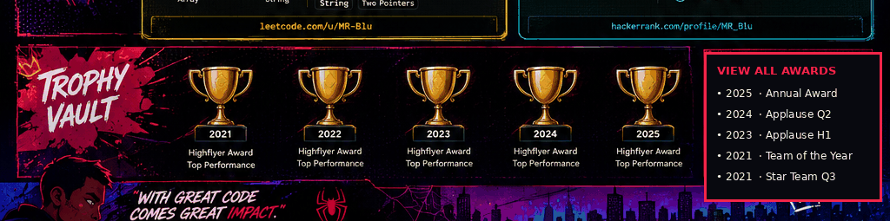

# MANISH RANJAN BEHERA

### Software Engineer · Backend · Distributed Systems · Cloud

`Java` · `Spring Boot` · `Microservices` · `SQL` · `AWS` · `GCP` · `Azure`

 

<a href="https://yashwanth-patam-portfolio.vercel.app/">🌐 Portfolio</a> &nbsp;•&nbsp;
<a href="https://www.linkedin.com/in/manishranjanbehera/">💼 LinkedIn</a> &nbsp;•&nbsp;
<a href="https://github.com/MrBlu1204">🐙 GitHub</a> &nbsp;•&nbsp;
<a href="https://leetcode.com/u/MR-Blu/">🧩 LeetCode</a> &nbsp;•&nbsp;
<a href="https://www.hackerrank.com/profile/MR_Blu">🏆 HackerRank</a> &nbsp;•&nbsp;
<a href="mailto:manish12042000@gmail.com">✉️ Email</a>

  

<a href="#about"><kbd>ABOUT</kbd></a>
&nbsp;
<a href="#impact"><kbd>IMPACT</kbd></a>
&nbsp;
<a href="#stack"><kbd>STACK</kbd></a>
&nbsp;
<a href="#experience"><kbd>EXPERIENCE</kbd></a>
&nbsp;
<a href="#projects"><kbd>PROJECTS</kbd></a>
&nbsp;
<a href="#coding"><kbd>CODING</kbd></a>
&nbsp;
<a href="#awards"><kbd>AWARDS</kbd></a>
&nbsp;
<a href="#contact"><kbd>CONTACT</kbd></a>

---

<table width="100%">
<tr>
<td width="60%" valign="top">

## 👋 ABOUT ME

I’m a software engineer focused on **backend engineering, distributed systems, production debugging and cloud infrastructure**.

My core stack is **Java + Spring Boot + SQL**, with practical experience across REST APIs, microservices, concurrency, performance optimization, observability and cloud platforms.

I enjoy taking a complicated production problem, tracing it to the real failure point, and turning the fix into a measurable engineering improvement.

</td>
<td width="40%" valign="top">

## ⚙️ ENGINEERING DNA

**BUILD**  
Java · Spring Boot · Spring MVC · Hibernate · REST

**SCALE**  
Microservices · Multithreading · Distributed Systems · DSA

**OPERATE**  
AWS · GCP · Azure · Docker · Kubernetes · CI/CD

**OBSERVE**  
Prometheus · Grafana · CloudWatch · Cloud SQL

**DATA**  
SQL · MySQL · Python · ETL · Redis · Kafka

</td>
</tr>
</table>

---

## ⚡ ENGINEERING IMPACT

| <strong>4+</strong> | <strong>100%</strong> | <strong>35%</strong> | <strong>25%</strong> | <strong>99%</strong> |
|:---:|:---:|:---:|:---:|:---:|
| Years across engineering & data | Traceability / accuracy | Faster processing | Fewer support tickets | Uptime target |

 

<strong>OPEN IMPACT LOG ↗</strong>

| Area | Engineering outcome |
|:---|:---|
| Financial reconciliation | **100% account-reconciliation traceability** |
| Microsoft Graph API pipeline | **100% data accuracy** across ingestion flows |
| Processing optimization | Up to **35% faster processing** through query/calculation optimization |
| Support diagnostics | **25% fewer support tickets** through better troubleshooting and automation |
| ETL / concurrency tuning | Measurable reduction in batch latency and resource contention |
| Cloud observability | Production monitoring across **AWS, GCP and Azure** |

---

## 🧬 TECH STACK

  

`Java 17` · `Spring Boot` · `Spring MVC` · `Hibernate` · `Struts` · `ExtJS`

`REST APIs` · `Microservices` · `Multithreading` · `Distributed Systems`

`SQL` · `MySQL` · `Redis` · `Kafka` · `Python` · `Maven`

`AWS` · `GCP` · `Azure` · `Docker` · `Kubernetes` · `GitLab CI/CD`

---

## 💼 EXPERIENCE

<table width="100%">
<tr>
<td width="70%" valign="top">

### Associate Technical Consultant II — HighRadius Technologies

`Jan 2024 → Present` · Hyderabad, India

- Collaborate with consultants and development teams to configure, debug and stabilize enterprise finance workflows.
- Diagnose Java/Spring Boot, integration, data and application-flow issues across production-facing systems.
- Trace failures through controllers, services, ORM/database layers and external integrations to identify root causes rather than symptoms.
- Optimize existing code paths, SQL queries and calculations for better processing performance.
- Work with senior engineers on technically complex incidents while continuously strengthening backend engineering skills.

</td>
<td width="30%" valign="top">

**PRIMARY LANE**

`Java`

`Spring Boot`

`Hibernate`

`SQL`

`Debugging`

`Performance`

`Cloud Monitoring`

</td>
</tr>
</table>

<strong>OPEN CAREER TRACE ↗</strong>

| Stage | Focus |
|:---:|:---|
| **2021–22** | Analytics / machine learning foundations |
| **2022–23** | Data engineering · Python · SQL · ETL |
| **2024→** | Backend engineering · Java · Spring · Hibernate |
| **Now** | Backend + distributed systems + cloud + production reliability |

---

## 🧩 SELECTED PROJECTS

<table width="100%">
<tr>
<td width="33%" valign="top">

### 🔥 Backend Systems Lab

Practical backend engineering experiments covering:

`Java` · `Spring Boot` · `REST` · `Concurrency` · `Caching`

<a href="https://github.com/MrBlu1204?tab=repositories">VIEW REPOSITORIES ↗</a>

</td>
<td width="33%" valign="top">

### ⚙️ Problem Solving

Interview-oriented implementations for:

`DSA` · `Collections` · `Multithreading` · `SQL`

<a href="https://leetcode.com/u/MR-Blu/">LEETCODE ↗</a>

</td>
<td width="33%" valign="top">

### ☁️ Cloud & Observability

Hands-on exploration of:

`AWS` · `GCP` · `Azure` · `Prometheus` · `Grafana`

<a href="https://github.com/MrBlu1204?tab=repositories">EXPLORE CODE ↗</a>

</td>
</tr>
</table>

---

## 🧠 CODING PROFILES

<table width="100%">
<tr>
<td width="50%" align="center">

### `LEETCODE // MR-BLU`

**Java · MySQL · DSA**

<a href="https://leetcode.com/u/MR-Blu/">OPEN PROFILE ↗</a>

</td>
<td width="50%" align="center">

### `HACKERRANK // MR_BLU`

**Java · Python · SQL · Problem Solving**

<a href="https://www.hackerrank.com/profile/MR_Blu">OPEN PROFILE ↗</a>

</td>
</tr>
</table>

---

## 🏆 RECOGNITION

<strong>OPEN AWARD ARCHIVE ↗</strong>

| Year | Recognition |
|:---:|:---|
| **2024** | Award of Applause — Highflyer Q2 |
| **2023** | Award of Applause — Highflyer H1 |
| **2021** | Team of the Year — Highflyer |
| **2021** | Star Team Award — Highflyer Q3 |

---

## 📈 GITHUB ACTIVITY

  

<a href="https://github.com/MrBlu1204?tab=repositories">ALL REPOSITORIES ↗</a>
&nbsp;•&nbsp;
<a href="https://github.com/MrBlu1204?tab=stars">STARRED REPOSITORIES ↗</a>

---

## 🚀 LET'S CONNECT

Backend systems · Java · Spring Boot · distributed systems · cloud engineering · technical problem solving

 

<a href="https://yashwanth-patam-portfolio.vercel.app/">🌐 PORTFOLIO</a>
&nbsp;•&nbsp;
<a href="https://www.linkedin.com/in/manishranjanbehera/">💼 LINKEDIN</a>
&nbsp;•&nbsp;
<a href="mailto:manish12042000@gmail.com">✉️ EMAIL</a>

  

BUILD WITH PURPOSE · DEBUG WITH CURIOSITY · SHIP WITH IMPACT

