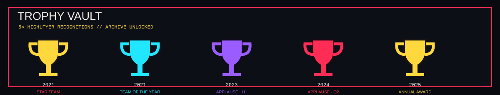

  

  <a href="https://github.com/MrBlu1204">GitHub</a> ·
  <a href="https://www.linkedin.com/in/manishranjanbehera/">LinkedIn</a> ·
  <a href="https://leetcode.com/u/MR-Blu/">LeetCode</a> ·
  <a href="https://www.hackerrank.com/profile/MR_Blu">HackerRank</a> ·
  <a href="mailto:manish12042000@gmail.com">Email</a>

<table align="center">
<tr>
<td align="center"><b>4+ yrs</b> Engineering</td>
<td align="center"><b>25%</b> Throughput ↑</td>
<td align="center"><b>15%</b> API latency ↓</td>
<td align="center"><b>99%</b> Uptime SLA</td>
<td align="center"><b>400K+</b> Requests/day/client</td>
</tr>
</table>

⚡ What I Build

<table>
<tr>
<td width="25%" align="center">⚙️ <b>Backend</b></td>
<td>Java · Spring Boot · REST · Microservices · Hibernate</td>
</tr>
<tr>
<td align="center">🧵 <b>Performance</b></td>
<td>Multithreading · concurrency · thread pools · query tuning · latency</td>
</tr>
<tr>
<td align="center">☁️ <b>Cloud</b></td>
<td>AWS · GCP · Azure · Prometheus · Grafana · CI/CD</td>
</tr>
<tr>
<td align="center">🗄️ <b>Data</b></td>
<td>Python · SQL · MySQL · ClickHouse · ETL · data pipelines</td>
</tr>
</table>

  

🎯 Current Role

  

Technical Consultant II · Software Engineer — HighRadius Technologies · Hyderabad
Jan 2026 – Present · Java · JavaScript · SQL · AWS · GCP · Azure

📈 Engineering Impact

<table>
<tr>
<td align="center" width="25%"><b>100%</b> Ledger traceability</td>
<td align="center" width="25%"><b>99%</b> Uptime SLA</td>
<td align="center" width="25%"><b>25%</b> Throughput ↑</td>
<td align="center" width="25%"><b>15%</b> API latency ↓</td>
</tr>
<tr>
<td align="center"><b>10%</b> Batch latency ↓</td>
<td align="center"><b>400K+</b> Requests/day/client</td>
<td align="center"><b>25%</b> Support tickets ↓</td>
<td align="center"><b>8 hrs/wk</b> Manual work saved</td>
</tr>
</table>

  

<b>2026</b> Reconciliation + IAM + multi-cloud reliability  →  <b>2025</b> Concurrency + ETL + Graph API  →  <b>2024</b> Microservices + diagnostics  →  <b>2022–23</b> Data engineering  →  <b>2021–22</b> ML + analytics

🏆 Recognition

  

<b>View all 5 awards</b>

Year

Recognition

2025

Annual Award — Highflyer

2024

Award of Applause — Highflyer Q2

2023

Award of Applause — Highflyer H1

2021

Team of the Year — Highflyer

2021

Star Team Award — Highflyer Q3

🧩 Coding & Profiles

<table align="center">
<tr>
<td align="center"> <b>LeetCode</b> MR-Blu</td>
<td align="center"> <b>HackerRank</b> MR_Blu</td>
<td align="center"> <b>GitHub</b> MrBlu1204</td>
<td align="center"> <b>LinkedIn</b> manishranjanbehera</td>
</tr>
</table>

  

HackerRank: Problem Solving — Basic & Intermediate · Python — Basic · SQL — Basic · Java Developer

🎓 Education

B.Tech · Computer Science & System Design — Kalinga Institute of Industrial Technology (KIIT) · 2018–2022 · CGPA 9.0

  <a href="mailto:manish12042000@gmail.com">Let's build something useful.</a>

