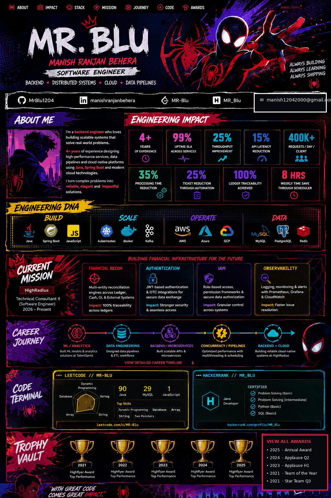

 

<a href="#about"><kbd>ABOUT</kbd></a>
&nbsp; <a href="#impact"><kbd>IMPACT</kbd></a>
&nbsp; <a href="#stack"><kbd>STACK</kbd></a>
&nbsp; <a href="#mission"><kbd>MISSION</kbd></a>
&nbsp; <a href="#journey"><kbd>JOURNEY</kbd></a>
&nbsp; <a href="#code"><kbd>CODE</kbd></a>
&nbsp; <a href="#awards"><kbd>AWARDS</kbd></a>

  

&nbsp;

&nbsp;

&nbsp;

&nbsp;

---

<table width="100%">
<tr>
<td width="62%" valign="top">

## 🕷️ ABOUT ME

### Software Engineer · Backend · Distributed Systems · Cloud

**4+ years** across backend engineering, data engineering, analytics and cloud infrastructure.

Core lane: **Java + Spring Boot**, with hands-on work across **microservices, distributed systems, concurrency, performance, observability and production debugging**.

I enjoy turning difficult production problems into measurable engineering outcomes.

</td>
<td width="38%" valign="top">

### `ENGINEERING DNA`

🟥 **BUILD** — Java · Spring Boot · Spring MVC · Hibernate · REST

🟦 **SCALE** — Microservices · Multithreading · Distributed Systems · DSA

🟨 **OPERATE** — AWS · GCP · Azure · Prometheus · Grafana · CI/CD

🟪 **DATA** — SQL · MySQL · ClickHouse · Python · ETL

</td>
</tr>
</table>

---

## ⚡ ENGINEERING IMPACT

| **4+** | **99%** | **25% ↑** | **15% ↓** | **400K+** |
|:---:|:---:|:---:|:---:|:---:|
| Years | Uptime SLA | Throughput | API latency | Req/day/client |

<b>OPEN IMPACT LOG</b>

| Signal | Result |
|:---|:---|
| Financial reconciliation | **100% ledger traceability** |
| Microsoft Graph ingestion | **100% data accuracy** at **400K+ requests/day/client** |
| ETL concurrency tuning | **10% batch-latency reduction** |
| Query + calculation optimisation | **35% processing-time reduction** |
| Diagnostic automation | **25% fewer support tickets** + **8 hrs/week saved** |
| ML payment prediction | **15% DSO reduction** + **10% model-accuracy improvement** |

---

## 🧬 ENGINEERING STACK

  

`Java` · `Spring Boot` · `Spring MVC` · `Hibernate` · `REST APIs` · `Microservices`

`Multithreading` · `Distributed Systems` · `AWS` · `GCP` · `Azure` · `SQL` · `Python`

---

## 🎯 CURRENT MISSION

<table width="100%">
<tr align="center">
<td width="20%"><b>HIGHRADIUS</b> Technical Consultant II Software Engineer 2026 → Present</td>
<td width="20%"><b>🔴 RECON</b> Credit Note automation <strong>100% traceability</strong></td>
<td width="20%"><b>🔵 AUTH</b> Java / SMTP / OTC <strong>Reliable delivery</strong></td>
<td width="20%"><b>🟣 IAM</b> Multi-tenant backend <strong>Stable sessions</strong></td>
<td width="20%"><b>🟡 CLOUD</b> AWS / GCP / Azure <strong>99% SLA</strong></td>
</tr>
</table>

<b>OPEN CURRENT-ROLE DOSSIER</b>

**Technical Consultant II (Software Engineer) · HighRadius Technologies · Jan 2026 → Present**

- Designed and deployed a financial reconciliation service using Java, JavaScript and SQL, automating Credit Note processing and achieving **100% traceability**.
- Resolved Java controller and SMTP integration failures restoring reliable One-Time Code delivery for password resets.
- Remediated database mapping defects affecting IAM reliability across multi-tenant backend services.
- Monitored and debugged AWS, GCP and Azure infrastructure using Prometheus and Grafana, maintaining a **99% uptime SLA**.

---

## 🌀 CAREER JOURNEY

**2021–22** → **ML / ANALYTICS** → **2022–23** → **DATA ENGINEERING** → **2024** → **BACKEND** → **2025** → **CONCURRENCY** → **2026→** → **BACKEND + CLOUD**

<b>OPEN CAREER TRACE</b>

| Period | Domain | Representative work |
|:---:|:---|:---|
| **2021–22** | ML / Analytics | Regression models · AWS EC2 · payment prediction |
| **2022–23** | Data / Analytics Engineering | Python · SQL · ETL · query optimisation |
| **2024** | Backend Engineering | Java · Spring Boot · Hibernate · microservices |
| **2025** | Concurrency / Performance | Thread pools · race conditions · high-volume ingestion |
| **2026→** | Backend + Cloud | Reconciliation · authentication · IAM · observability |

---

## 💻 CODE // TWO DIMENSIONS

<table width="100%">
<tr>
<td width="50%" align="center">

### `LEETCODE // MR-BLU`

**90 Java · 29 MySQL · 1 JavaScript**

`Dynamic Programming` · `Database` · `Array` · `String` · `Two Pointers`

<a href="https://leetcode.com/u/MR-Blu/">OPEN PROFILE ↗</a>

</td>
<td width="50%" align="center">

### `HACKERRANK // MR_BLU`

**JAVA DEVELOPER**

`Problem Solving · Basic` · `Problem Solving · Intermediate`

`Python · Basic` · `SQL · Basic`

<a href="https://www.hackerrank.com/profile/MR_Blu">OPEN PROFILE ↗</a>

</td>
</tr>
</table>

---

## 🏆 TROPHY VAULT

<b>OPEN AWARD ARCHIVE</b>

| Year | Recognition |
|:---:|:---|
| **2025** | 🏆 Annual Award — Highflyer |
| **2024** | 👏 Award of Applause — Highflyer Q2 |
| **2023** | 👏 Award of Applause — Highflyer H1 |
| **2021** | 🏆 Team of the Year — Highflyer |
| **2021** | ⭐ Star Team Award — Highflyer Q3 |

---

## 🎓 EDUCATION

**KIIT · B.Tech — Computer Science & System Design**  
`CGPA 9.0` · `2018 — 2022`

 

<a href="https://www.linkedin.com/in/manishranjanbehera/">LINKEDIN</a> ·
<a href="https://github.com/MrBlu1204">GITHUB</a> ·
<a href="mailto:manish12042000@gmail.com">EMAIL</a>

  

BUILD WITH PURPOSE · DEBUG WITH CURIOSITY · SHIP WITH IMPACT

'''

# Create a placeholder awards GIF if old one isn't available: reuse a compact crop of the concept's trophy region with subtle flicker.
from PIL import Image, ImageEnhance
concept=Image.open(master).convert('RGB') if (master:=AS/'profile-poster.png') else None
# Crop trophy region from the concept for animation, preserving the design language.
# Based on the concept layout: lower trophy shelf.
cr=concept.crop((0,1310,1024,1515))
aw=[]
for i in range(8): aw.append(ImageEnhance.Contrast(cr).enhance(1+0.03*math.sin(i*math.pi/2)))
aw[0].save(AS/'awards.gif',save_all=True,append_images=aw[1:],duration=180,loop=0)

# small local AWS icon isn't needed for the primary concept; the actual stack text is semantic.
(root/'INSTALL.md').write_text("""# Install\n\nCopy `README.md` and the complete `assets/` folder into the public profile repository `MrBlu1204/MrBlu1204`.\n\nThe large profile poster and animations are repository-local assets.\n""",encoding='utf-8')

zip_path=Path('/mnt/data/MrBlu1204-spiderverse-concept-final.zip')
with zipfile.ZipFile(zip_path,'w',zipfile.ZIP_DEFLATED) as z:
    for p in root.rglob('*'):
        if p.is_file(): z.write(p,p.relative_to(root.parent))
print(zip_path)
PY
