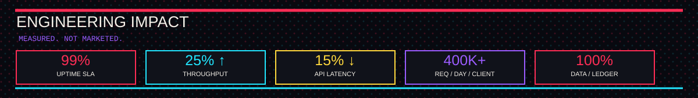
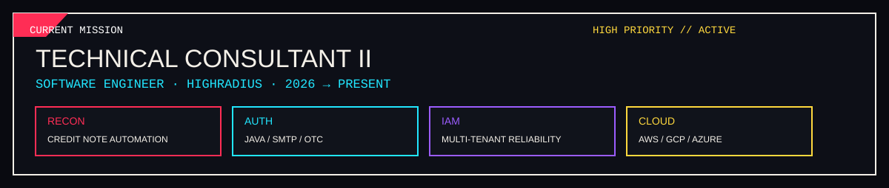
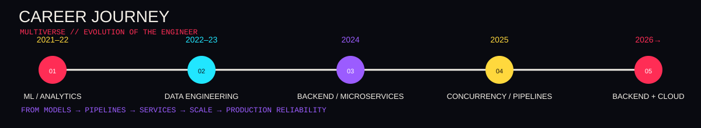

 

<a href="#about"><kbd>ABOUT</kbd></a>
 
<a href="#impact"><kbd>IMPACT</kbd></a>
 
<a href="#focus"><kbd>FOCUS</kbd></a>
 
<a href="#mission"><kbd>MISSION</kbd></a>
 
<a href="#journey"><kbd>JOURNEY</kbd></a>
 
<a href="#code"><kbd>CODE</kbd></a>
 
<a href="#vault"><kbd>VAULT</kbd></a>

  

  

  

  

  

  

<table width="100%">
<tr>
<td width="67%" valign="top">

🕷️ ABOUT // EARTH-1204

Software Engineer building the systems behind the screen.

4+ years across backend engineering, data engineering, analytics and cloud infrastructure.

My core lane is Java + Spring Boot, with hands-on work in microservices, distributed systems, concurrency, performance, observability and production debugging.

I like problems where the happy path is easy — and production isn't.

</td>

<td width="33%" align="center">

ENGINEERING DNA

<kbd>JAVA</kbd> 
<kbd>SPRING BOOT</kbd> 
<kbd>DISTRIBUTED SYSTEMS</kbd> 
<kbd>PERFORMANCE</kbd> 
<kbd>RELIABILITY</kbd> 
<kbd>CLOUD</kbd> 
<kbd>DATA</kbd>

</td>
</tr>
</table>

<b>🕸️ OPEN IMPACT LOG</b>

SIGNAL

RESULT

Ledger automation

100% traceability

Microsoft Graph ingestion

100% data accuracy at 400K+ requests/day/client

ETL concurrency tuning

10% batch-latency reduction

Query + model optimisation

35% processing-time reduction

Diagnostic automation

25% fewer support tickets + 8 hrs/week saved

ML payment prediction

15% DSO reduction + 10% model-accuracy improvement

🧬 ENGINEERING FOCUS

<table width="100%">
<tr>
<td align="center" width="25%">

🟥 BUILD

Java
Spring Boot
Spring MVC
Hibernate
REST APIs

</td>

<td align="center" width="25%">

🟦 SCALE

Microservices
Distributed Systems
Multithreading
DSA
Object-Oriented Design

</td>

<td align="center" width="25%">

🟨 OPERATE

AWS
GCP
Azure
Prometheus
Grafana
CI/CD

</td>

<td align="center" width="25%">

🟪 DATA

SQL
MySQL
ClickHouse
Python
ETL / Pipelines

</td>
</tr>
</table>

  

AWS: EC2 · RDS · SQS · SNS

<b>OPEN CURRENT-ROLE DOSSIER</b>

Technical Consultant II (Software Engineer) · HighRadius Technologies · Jan 2026 → Present

Financial Reconciliation → automated Credit Note processing with 100% ledger traceability

Authentication → Java controller / SMTP remediation for reliable OTC delivery

IAM → database-mapping remediation across multi-tenant backend services

Observability → AWS / GCP / Azure monitoring with Prometheus + Grafana, maintaining 99% uptime SLA

<b>OPEN CAREER TRACE</b>

PERIOD

ROLE / DOMAIN

SIGNAL

2021–22

Machine Learning

Regression models · AWS EC2 · prediction

2022–23

Data / Analytics Engineering

Python · SQL · ETL · query optimisation

2024

Backend Engineering

Java · Spring Boot · Hibernate · microservices

2025

Performance / Concurrency

Thread pools · race conditions · data ingestion

2026→

Backend + Cloud

Reconciliation · IAM · auth · observability

🎮 CODE // TWO DIMENSIONS

<table width="100%">
<tr>
<td align="center" width="50%">

LEETCODE // MR-BLU

90 Java · 29 MySQL · 1 JavaScript

Dynamic Programming · Database
Array · String · Two Pointers

<a href="https://leetcode.com/u/MR-Blu/"><kbd>ENTER DIMENSION ↗</kbd></a>

</td>

<td align="center" width="50%">

HACKERRANK // MR_BLU

JAVA DEVELOPER

Problem Solving · Basic
Problem Solving · Intermediate
Python · Basic · SQL · Basic

<a href="https://www.hackerrank.com/profile/MR_Blu"><kbd>ENTER DIMENSION ↗</kbd></a>

</td>
</tr>
</table>

<b>🏆 OPEN TROPHY ARCHIVE</b>

 

YEAR

AWARD

2025

🏆 Annual Award — Highflyer

2024

👏 Award of Applause — Highflyer Q2

2023

👏 Award of Applause — Highflyer H1

2021

🏆 Team of the Year — Highflyer

2021

⭐ Star Team Award — Highflyer Q3

EDUCATION NODE

KIIT · B.Tech — Computer Science & System Design

CGPA 9.0 · 2018 — 2022

 

<a href="https://www.linkedin.com/in/manishranjanbehera/"><kbd>LINKEDIN</kbd></a>
<a href="https://github.com/MrBlu1204"><kbd>GITHUB</kbd></a>
<a href="mailto:manish12042000@gmail.com"><kbd>EMAIL</kbd></a>

  

BUILD WITH PURPOSE · DEBUG WITH CURIOSITY · SHIP WITH IMPACT

